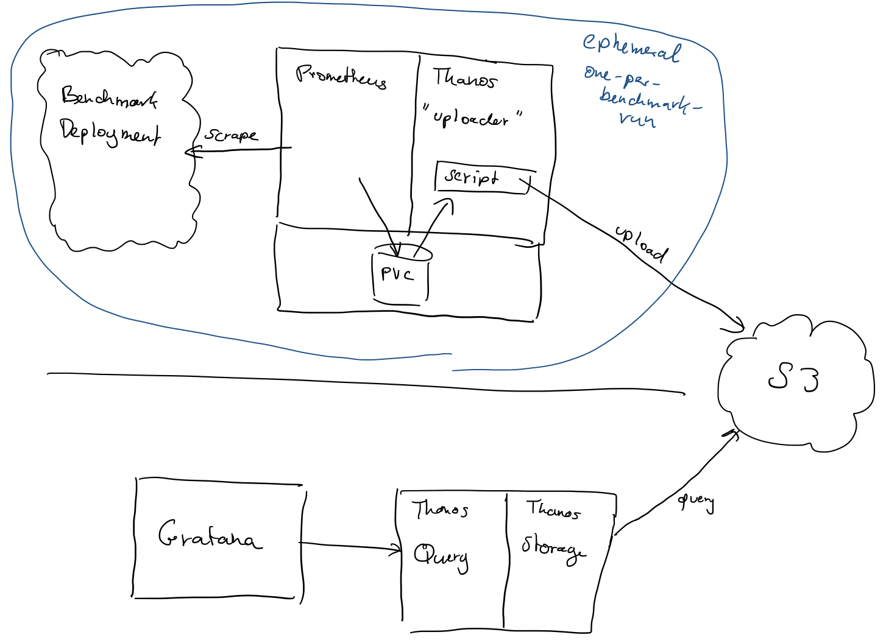

# The idea

## Frequent benchmarks runs

As part of Continuous Integration it makes sense to run benchmarks or other stress tests for which performance observability is key. These benchmarks or tests are usually automatically triggered by CI/CD pipelines and run many times a day. As the intention is to benchmark/test on new builds (reflecting the changes made to the code repository), the typical pattern is for the CI/CD pipeline to spin up an instance of the build, run the tests and then tear down that instance again. In other words, the deployments are ephemeral and only live for the duration of the run itself. Keeping performance data for these runs is a key requirement, both for bug triage as well as history to understand the evoluation of performance.

To accomplish this, one could connect the epehermal deployments to a long lived Prometheus instance. However, that represents state and is potentially not scalable, e.g. when over time multiple benchmark runs happen in parallel. It is much more desirable to have each deployment use its own ephemeral Prometheus instance, but keep the performance data around long term. Thanos seems perfectly suited for this, as it has a component (the sidecar) to facilitate uploading to S3, while the querying component is separate. 

## Archive of benchmark performance data

If we assume that the benchmark runs use entirely ephemeral infrastructure except for S3, then we need a separate infrastructure to facilite viewing/analyzing of the gathered performance data. Thanos is perfect for this. Thanos Storage together with Thanos Query expose the S3 data in a Prometheus compatible API and thus Grafanna or other tools can query from it. Thus, we can spin up long running (or ephemeral) Thanos+Grafana to view the long-term stored benchmark performance data. So rather than the traditional Thanos architecture, where the live Prometheus and the long-term retained data on S3 are all worked on in the same infrastructure, here we decouple them cleanly

# Architecture



## Components

### Benchmark and Prometheus 

We set up the bechmark/stress run however we would normally do it. Similarly, we create a Prometheus instance which is configured to scrape the benchmark using whatever tooling we would always use.

### Thanos Uploader

The Thanos "uploader" is a repurposed Thanos Sidecar. It is a sidecar container to Prometheus, and uses the Thanos image, but doesn't run the sidecar daemon. In fact, it doesn't run any daemon. Instead, it contains a script which will:
* Use Prometheus Admin API to trigger a Prometheus snapshot
* Run Thanos sidecar to upload that snapshot to S3
* Once all blocks are uploaded, kills Thanos sidecar

This script runs as a preStop handler. This means that Prometheus collects metrics as always, and when it comes time to shut down the ephemeral Prometheus instance we ensure Prometheus dumps all blocks to disk (via snapshot API) and then let Thanos upload all of it to S3, and then we can really shut down, and destroy the Prometheus Pod and PVC.

The upload script looks like this:
```
apiVersion: v1
kind: ConfigMap
metadata:
  name: thanos-util
data:
  thanos-oneoff.sh: |
    # We use the jq tool to parse JSON and retrieve properties
    wget -O /jq https://github.com/stedolan/jq/releases/download/jq-1.6/jq-linux64
    chmod +x /jq

    # Trigger a prometheus snapshot. Store directory path of snapshot to
    # /snap.dir file.
    wget -O /snap.json --post-data '' http://localhost:9090/api/v1/admin/tsdb/snapshot
    cat /snap.json | /jq '.data.name | "/prometheus/data/snapshots/\(.)/"' | sed 's/"//g' > /snap.dir
    ls -l `cat /snap.dir`

    # Run thanos to perform upload ...
    # We can't make thanos exit after uploading the snapshot, so we need
    # to start it as a daemon, check its progress and then kill it
    thanos sidecar --tsdb.path `cat /snap.json | /jq '.data.name | "/prometheus/data/snapshots/\(.)/"' | sed 's/"//g'` \
      --prometheus.url "http://localhost:9090" \
      --http-address="0.0.0.0:10903" --grpc-address="0.0.0.0:10904" \
      --objstore.config-file=/thanos-config/s3.yaml &
    
    # Check every N seconds if now all blocks (directories in the snapshot
    # directory) are uploaded by Thanos by checking the thanos.shipper.json
    # file.
    touch /notdone
    while [ -f /notdone ]; do 
      sleep 5
      rm /notdone
      # If any of the directories doesn't show up in the shipper.json, then a
      # file /notdone is created
      for x in `ls $(cat /snap.dir) | grep -v missing | grep -v thanos`; do if ! cat `cat /snap.dir`thanos.shipper.json | grep $x; then touch /notdone; fi  done
    done
    # We are done, kill thanos
    killall thanos
```

And the Prometheus+Thanos Pod may look like this:
```
apiVersion: apps/v1
kind: Deployment
metadata:
  name: prometheus-deploy
  labels:
    app: prometheus
spec:
  replicas: 1
  selector:
    matchLabels:
      app: prometheus
  template:
    metadata:
      labels:
        app: prometheus
    spec:
      volumes:
      - name: shared-volume
        emptyDir: {}
      - name: config-volume
        configMap:
          name: prometheus-config
      - name: thanos-config
        configMap:
          name: thanos-config
      - name: thanos-util
        configMap:
          name: thanos-util
      - name: data-volume
        emptyDir: {}

      containers:

      - name: prometheus
        image: prom/prometheus
        volumeMounts:
        - name: data-volume
          mountPath: /prometheus/data
        - name: shared-volume
          mountPath: /prom-config-server
        - name: config-volume
          mountPath: /prom-config
        args:
        - "--config.file=/prom-config/prometheus.yml"
        - --web.enable-lifecycle
        # Thanos wants us to fix the window to 2h to not have compaction
        - --storage.tsdb.min-block-duration=2h
        - --storage.tsdb.max-block-duration=2h
        # Enable the admin API so that we can trigger a snapshot
        - --web.enable-admin-api
        ports:
        - containerPort: 9090

      - name: thanos
        image: thanosio/thanos:v0.8.0
        command: ['sh']
        args: ["-c", "while true; do date; echo hello, world!; sleep 60; done"]
        volumeMounts:
        - name: data-volume
          mountPath: /prometheus/data
        - name: shared-volume
          mountPath: /prom-config-server
        - name: config-volume
          mountPath: /prom-config
        - name: thanos-config
          mountPath: /thanos-config
        - name: thanos-util
          mountPath: /thanos-util

      # Any further sidecars, e.g. for service discovery, may go here
```

### Thanos Store + Query, Grafana

Thanos Store and Query, combined with Grafana are run unmodified in a separate infrastructure. It can be run long-term or spawned on-demand as ephemeral infrastructure. It doesn't run Prometheus as there is no live system to be monitored. Instead, the entire purpose is to be able to view historic data from all benchmark runs ever done.
