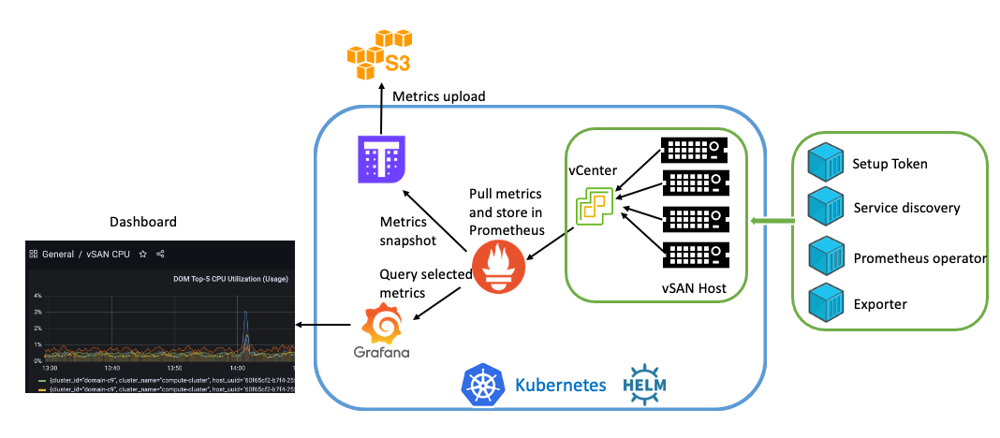

# vSAN Prometheus Monitoring
## Introduction

IT infrastructure monitoring is critical for delivering always-on-line business.
This repo makes the cloud native monitoring solutions possible for workloads running on vSphere/vSAN.
And this repo has dependency with open source tools:
* Docker
* Kubernetes
* Helm
* Grafana
* Prometheus
* Thanos

Docker, Kubernetes and Helm are used for packing, running and orchestrating containers, while 
Grafana, Prometheus are monitoring solutions. Thanos comes in the picture for handling the 
Prometheus data for archiving/retrieving with S3 objects.

## Architecture
This repo based on the following monitoring architecture. 

To make it possible, four containers are introduced token setup, service discovery, 
Prometheus Operator and vSAN exporter. The [Development page](./development.md) gives 
details for each container, including its role, usage and codes; and [Getting started](./docs/getting-started.md) page
shows how to use them by giving sample commands.

