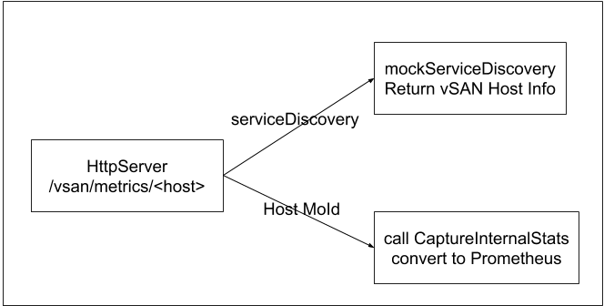

## vsan-prometheus-exporter
The vsan-prometheus-exporter container can convert the output of the per-host vSAN stats API (which is a 
JSON that basically comes almost straight out of VSI, i.e. it is "sum total value over all time"
as much as possible) to the prometheus format. The idea is that we can also take 
this code and bake it into ESX directly, offering a new prometheus friendly API.
But the external version is great for existing ESX servers.

This container targets previous vSAN builds which does support host Prometheus exporter, what this container does including:

* Python code that can translate vSAN internal stats format to the one Prometheus expects
* The exporter runs as a daemon exporting a HTTP API which can be used to get Prometheus stats output for any ESX server
* Only a small subset of stats is covered right now, but it is the most important subset

### Setup the exporter

```
cd vsan-prometheus-exporter
docker build -t vsan-prometheus-exporter .
docker run --rm -p 8080:8080 -e VCENTER=<vCenterHostname> -e VCPORT=<vCenterPort> -e VCUSER=<vCenterUsername> -e VCPASSWORD=<vCenterPassword> -e CLUSTERNAME=<vCenterClustername> vsan-prometheus-exporter
```

### The Design
The vsan vsan-prometheus-exporter container launches a HTTP server for listening the HTTP Prometheus requests.
The server accepts /vsan/metrics/<host> path. 



* If host is `serviceDiscovery`, it returns similar output with vCenter serviceDiscovery API.
* The host can be each host moId, it invokes API `CaptureInternalStats` and converts to Prometheus format.


See [HELP.md](HELP.md) for more details.

### Sample output of the exporter

[rev2.txt](rev2.txt)
