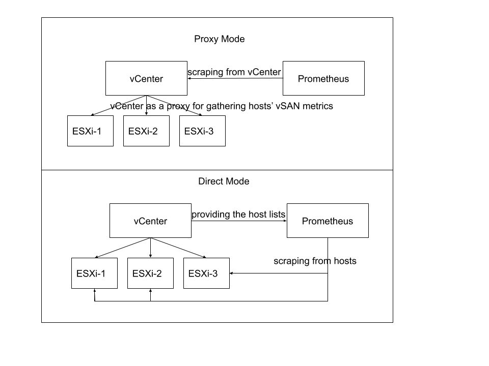

## vsan-prometheus-servicediscovery
The vsan-prometheus-servicediscovery container is used as a sidecar container for Prometheus vSAN service discovery.
It periodically updates vSAN server list file based on Prometheus file-based service discovery feature.
The vSAN server list result is from vCenter service discovery REST API, which offers the list of active vSAN hosts with 
Prometheus friendly labeling meta data.

This container provides two modes for Prometheus scraping vsan metrics (by environment variable MODE): proxy or direct. 
* In proxy mode, vCenter serves as a proxy for gathering every vSAN host metrics, and Prometheus scraps data from vCenter. 
The proxy mode is used when hosts cannot be accessed directly by Prometheus.
* In direct mode, vCenter provides server list to Prometheus, and Prometheus scraps data directly from
each host. This mode is vCenter fault tolerance solution.



## Usage 
There are two ways for running this container: 
* Sidecar container: the vsan-prometheus-servicediscovery container can be added to Prometheus deployment as its sidecar.
* Standalone container: Running this container directly to obtain the server list ouput
    ```
    docker run -e STANDALONE=True -e BEARER_TOKEN='XXX' -e VCENTER=XXX vmware/vsan-prometheus-servicediscovery:beta-0.11
    ```
    If you want to have each vSAN host prometheus metrics url, you can pass the environment variable MODE=direct 
    ```
    docker run -e STANDALONE=True -e MODE=direct -e BEARER_TOKEN='XXX' -e VCENTER=XXX vmware/vsan-prometheus-servicediscovery:beta-0.11
    ```
    If vSAN CA certificate is needed, you can pass the certificate file
    ```
    docker run -v <full-path-ca-file>:/etc/cert-volume/ca_cert.pem -e STANDALONE=True -e BEARER_TOKEN=XXX -e VCENTER=XXX vmware/vsan-prometheus-servicediscovery:beta-0.11
    ``` 
## Sidecar container
The vsan-prometheus-servicediscovery container can be used as a sideCar container in Prometheus deployment.
A secret is needed for providing container environment values in such case. 
The [prometheus-value.yaml](../yaml/prometheus-value.yaml) shows an example for passing environment values through bearer-token-secret.
Please read the environment variables section for adjusting passing values.

For applying the vSAN Prometheus security verification, the CA certificate file can be passed to bearer-token-secret: 
```
kubectl create secret generic bearer-token-secret --from-literal=bearer-token=<token> --from-literal=vcenter=<vCenter> --from-file=ca_cert.pem
```
he [prometheus-value.yaml](../yaml/prometheus-value.yaml)

## Development
This container is based Photon 3.0 image with Python3 installed. 
You can update python scripts based on your needs.
To rebuild the image, you can apply the commands:
```
cd vsan-prometheus-servicediscovery
docker build -t vsan-prometheus-servicediscovery . 
```
Also check related Yaml files for using the local build image instead of the image from VMware dockerHub repo.

### Environment Variables
 |  Variables |  Default Value | Notes  | 
|:---:|:---|---|
|  VCENTER | From YAML File   | The vCenter IP address  |
|  CONFIG_DIR | /prom-config-server/servers.json  | The path for generated server list file  |
|  INTERVAL_SEC | 300 (seconds) as Default  | The interval for updating server list  |
|  BEARER_TOKEN_FILE | /etc/secret-volume/bearer-token  | The bearer token secret is mapped into volume  |
|  BEARER_TOKEN | From environment variable  | The bearer token value  |
|  DISCOVERY_ENDPOINT | vsan/metrics/serviceDiscovery  | The vCenter service discovery endpoint  |
|  MODE | proxy | Proxy mode is about to query data from vCenter,  direct mode is about querying data from vSAN hosts. |
|  CA_CERT_FILE | /etc/secret-volume/ca_cert.pem | The vCenter CA certificate file default path|


## Output data
In default proxy mode, the sample vSAN service discovery result:
```
[
  {
    "targets": [
      "sc-rdops-vm01-dhcp-29-255.eng.vmware.com:443"
    ],
    "labels": {
      "__metrics_path__": "/vsan/metrics/host-16",
      "cluster_name": "VSAN-Cluster",
      "cluster_id": "domain-c8"
    }
  },
  {
    "targets": [
      "sc-rdops-vm01-dhcp-29-255.eng.vmware.com:443"
    ],
    "labels": {
      "__metrics_path__": "/vsan/metrics/host-28",
      "cluster_name": "VSAN-Cluster",
      "cluster_id": "domain-c8"
    }
  },
  {
    "targets": [
      "sc-rdops-vm01-dhcp-29-255.eng.vmware.com:443"
    ],
    "labels": {
      "__metrics_path__": "/vsan/metrics/host-22",
      "cluster_name": "VSAN-Cluster",
      "cluster_id": "domain-c8"
    }
  }
]
```

In direct mode, the sample vSAN service discovery result:
```
[
  {
    "targets": [
      "10.160.13.83:443"
    ],
    "labels": {
      "__metrics_path__": "/vsanmetrics",
      "cluster_name": "VSAN-Cluster",
      "cluster_id": "domain-c8"
    }
  },
  {
    "targets": [
      "10.160.30.152:443"
    ],
    "labels": {
      "__metrics_path__": "/vsanmetrics",
      "cluster_name": "VSAN-Cluster",
      "cluster_id": "domain-c8"
    }
  },
  {
    "targets": [
      "10.160.22.26:443"
    ],
    "labels": {
      "__metrics_path__": "/vsanmetrics",
      "cluster_name": "VSAN-Cluster",
      "cluster_id": "domain-c8"
    }
  }
]
```